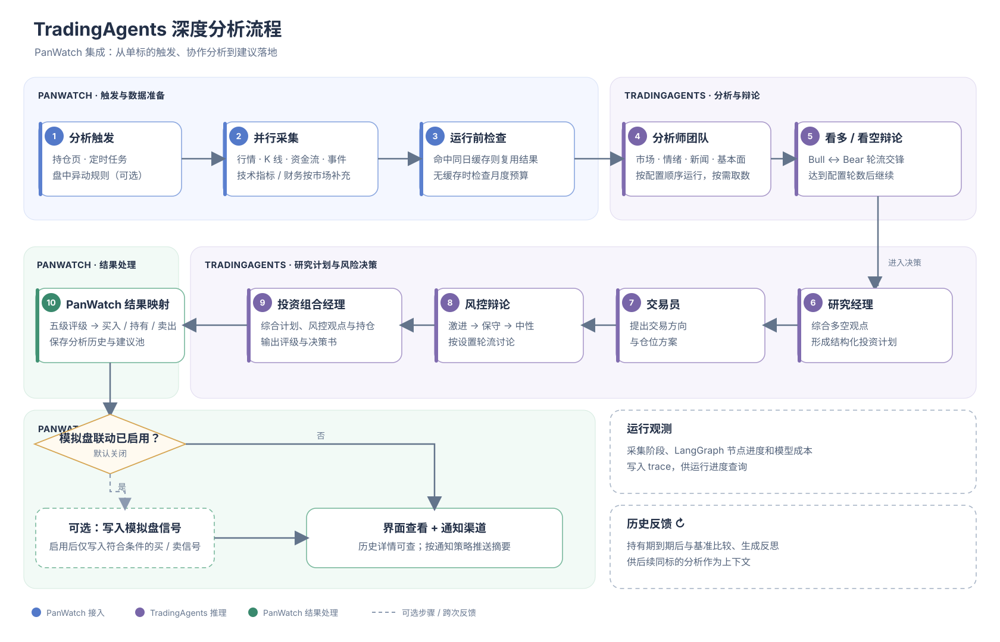

# TradingAgents 深度分析流程

PanWatch 从持仓页、Agent 定时任务或已启用的盘中异动规则触发单标的分析。下图展示 PanWatch 的数据准备与结果处理，以及 TradingAgents 内部的多 Agent 决策流程。

研究辩论和风控讨论轮数均可配置。图中的模拟盘联动默认关闭；开启后，符合条件的买入或卖出建议才会写入模拟盘信号。TradingAgents 的评级会映射为 PanWatch 的买入、持有或卖出建议；无法解析的评级会标记为待人工复核。

TradingAgents 会单独保存决策日志；持有期结束且行情数据可用后，会将相对基准的表现和反思带入后续同标的分析。PanWatch 的分析历史和建议池用于展示结果，与这份上游决策日志分开保存。

## 相关实现

- [TradingAgentsAgent：采集、缓存、预算检查与上游图调用](../src/modules/automation/tradingagents/agent.py)
- [PanWatch 数据上下文与持仓转换](../src/modules/automation/tradingagents/data_context.py)
- [PanWatch 行情工具适配](../src/modules/automation/tradingagents/toolkit_adapter.py)
- [决策评级映射与模拟盘信号桥接](../src/modules/automation/tradingagents/decision.py)
- [TradingAgents 上游多 Agent 流程（PanWatch 当前依赖 v0.5.0）](https://github.com/TauricResearch/TradingAgents/blob/v0.5.0/tradingagents/graph/setup.py)
